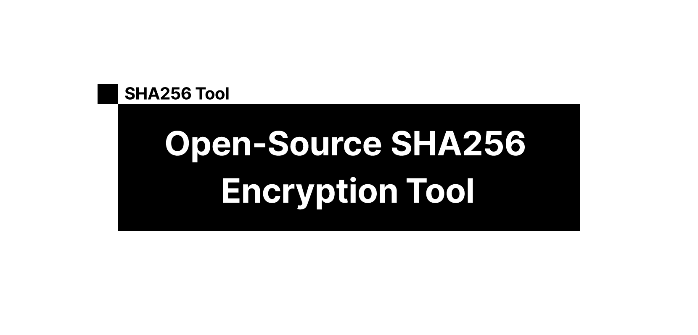

<a href="https://sha256-encrypt.vercel.app/">
  
  <h1 align="center">Open-Source SHA256 Encryption Tool</h1>
</a>

<p align="center">
  Generate SHA256 hashes for any string using this open-source tool built with native browser Web APIs.
</p>

<p align="center">
  <a href="#features"><strong>Features</strong></a> ·
  <a href="#privacy-and-security"><strong>Privacy</strong></a> ·
  <a href="#running-locally"><strong>Running locally</strong></a>
</p>
<br/>

## Features

- [Next.js](https://nextjs.org) App Router
- React Server Components (RSCs), Suspense, and Server Actions
- Edge runtime-ready
- [shadcn/ui](https://ui.shadcn.com)
  - Styling with [Tailwind CSS](https://tailwindcss.com)
  - [Radix UI](https://radix-ui.com) for headless component primitives
  - Icons from [Phosphor Icons](https://phosphoricons.com)

## Privacy and Security

The website https://sha256.scoredetect.com/ does not collect any data from users. The website is hosted on [Vercel](https://vercel.com) and is served over HTTPS.

## Running locally

1. First, clone the repository.

2. Install the `pnpm` command. See https://pnpm.io/installation for more information.

3. Install the dependencies:

```bash
pnpm install
```

4. Run the development server:

```bash
pnpm dev
```

5. You can now visit [`localhost:3000`](http://localhost:3000) from your browser to see the app.

Your app template should now be running on [localhost:3000](http://localhost:3000/).
