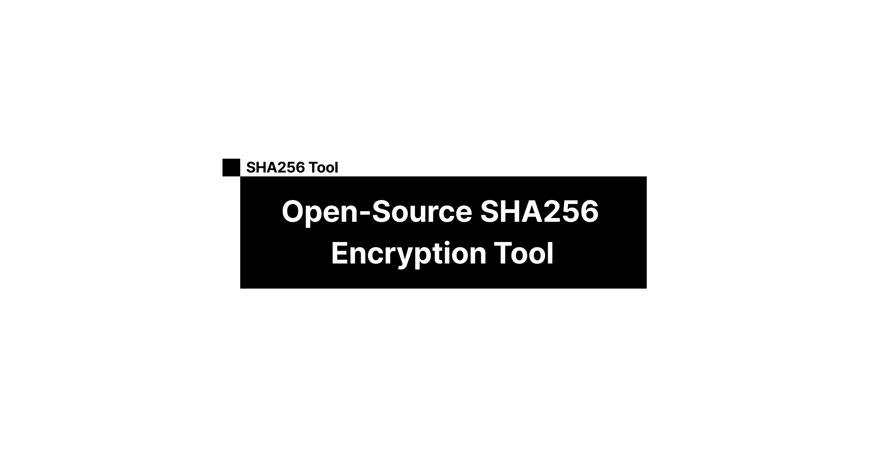

<a href="https://sha256-encrypt.vercel.app/">
  
  <h1 align="center">Open-Source SHA256 Encryption Tool</h1>
</a>

<p align="center">
  Generate SHA256 hashes for any string using this open-source tool built with <a href="https://www.openssl.org/" target="_blank">OpenSSL</a>.
</p>

<p align="center">
  <a href="#features"><strong>Features</strong></a> ·
  <a href="#running-locally"><strong>Running locally</strong></a>
</p>
<br/>

## Features

- [Next.js](https://nextjs.org) App Router
- React Server Components (RSCs), Suspense, and Server Actions
- Edge runtime-ready
- [shadcn/ui](https://ui.shadcn.com)
  - Styling with [Tailwind CSS](https://tailwindcss.com)
  - [Radix UI](https://radix-ui.com) for headless component primitives
  - Icons from [Phosphor Icons](https://phosphoricons.com)

## Running locally

First, clone the repository:

```bash
git clone
```

Install the dependencies:

```bash
pnpm install
pnpm dev
```

Your app template should now be running on [localhost:3000](http://localhost:3000/).
